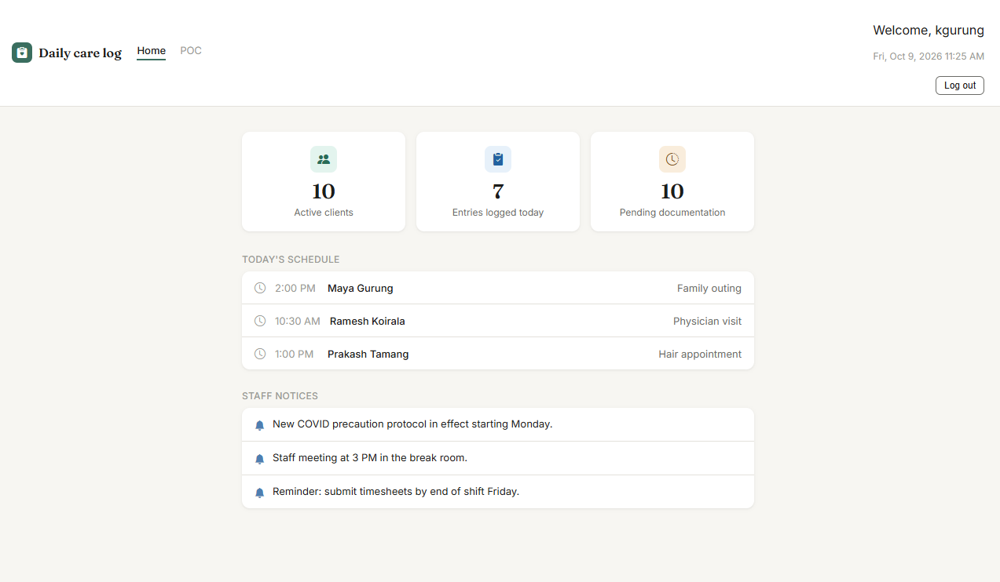
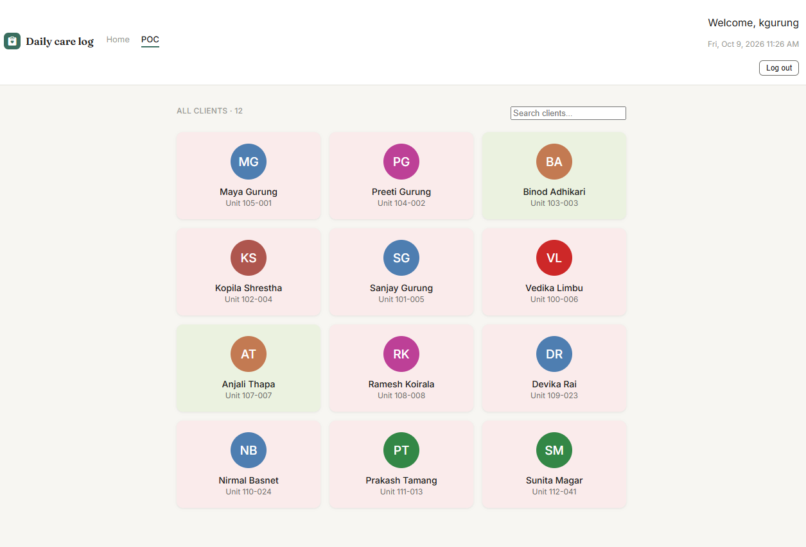
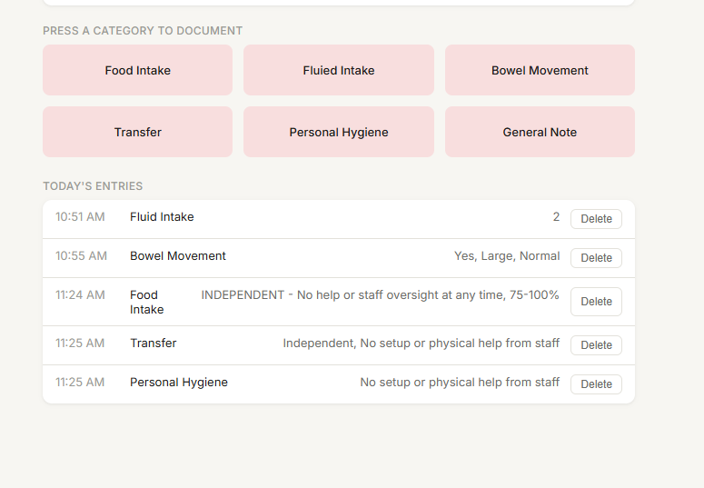

# Daily Care Log

A point-of-care documentation app for healthcare workers, built with React. Staff log in, pick a client, and document daily care (food intake, fluid intake, bowel movements, transfers, personal hygiene and notes) through quick, structured inputs instead of free-typed text.

Inspired by the daily documentation workflows I used as a healthcare worker.

> **Demo data notice:** every client, staff member, schedule item, and notice in this project is fictional. No real client or patient information is used anywhere.

[Live demo]("coming soon") |  Demo login: kgurung / k123





---

## Features

**Authentication**

- Login validated against a list of staff accounts, with an inline error message on failure
- Session persists across page refreshes; log out from the header

**Home**

- At-a-glance stats: active clients, entries logged today, and clients still pending documentation
- Today's schedule (outings, appointments) and staff notices

**POC (client overview)**

- Grid of all clients with initials avatars
- Live search by name
- Card color shows at a glance whether a client has been documented today

**Client detail and care logging**

- Six categories, each opening a modal with the questions that category needs
- Structured inputs: button choices for assistance level and amount eaten, a number field for fluid intake, free text only for general notes
- Conditional questions: "What type?" only appears after a bowel movement is recorded as "Yes"
- Duplicate protection: logging a category that is already documented today prompts you to **edit** the existing entry or **log a correction**
- Corrections keep the original entry visible (struck through and tagged "Corrected") so nothing is silently erased
- Delete with a custom confirmation dialog
- All entries persist in the browser (localStorage)

---

## Tech stack

- **React** with hooks (`useState`, `useEffect`)
- **Vite** for tooling
- **React Router** for page navigation and URL parameters (`/clients/:id`)
- **Plain CSS** with custom properties as design tokens (colors, fonts, shadows)
- **Bootstrap Icons** and **Google Fonts** (Fraunces and Inter)

---

## Run locally

```bash
git clone https://github.com/dpkalimbu-dev/care-log.git
cd care-log
npm install
npm run dev
```

Then open the local URL Vite prints (usually `http://localhost:5173`).

**Demo accounts**

| Username  | Password |
| --------- | -------- |
| kgurung   | k123     |
| pgurung   | p123     |
| badhikari | b123     |
| dlimbu    | d123     |

## Project structure

```
src/
├── components/       Reusable pieces
│   ├── AppHeader         Shared header, tabs, and user area
│   ├── ClientCard        Client tile with initials avatar
│   ├── CategoryCard      Clickable care category
│   ├── LogEntryForm      Modal that renders questions per category
│   ├── DuplicateEntryPrompt   Edit / correct choice
│   └── ConfirmDialog     Reusable confirmation popup
├── data/             Fictional demo data
│   ├── staff.js, clients.js, schedule.js, announcements.js
│   ├── logEntries.js         Seed entries
│   └── categoryQuestions.js  Question definitions for each category
├── pages/            Full screens: Login, Home, Dashboard (POC), ClientDetail
├── utils/            Small helpers: formatTime, isToday
├── App.jsx           Login gate, routes, and shared state
└── index.css         Global styles and design tokens

```
